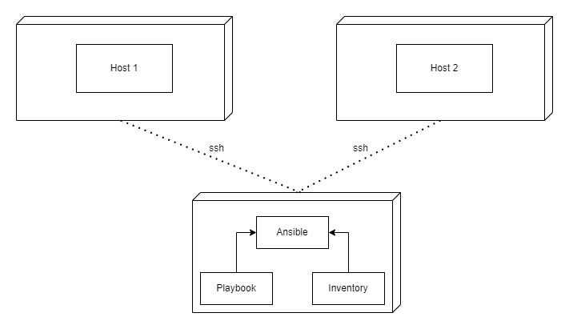

## What is Ansible

**Ansible** is a an open-source tool that automates application deployment, instar service orchestration, cloud provisioning among other functionalities.

A basic ansible environment has three main components:
-   **Control node** – a system on which ansible is installed.
-   **Managed node** – a remote system, or hots that ansible controls
-   **Inventory** – a list of managed nodes that are logically organized.


Ansible uses a playbook to describe automation jobs and playbook uses YAML language which is human-readable thus can be understood easily by anyone.

Ansible was developed with multi-tier deployment in mind. Ansible models IT architecture by specifying how all of your systems are interconnected, rather than managing one system at a time. Because Ansible is entirely agentless, it connects your nodes using SSH to function (by default). However, Ansible gives you the option of using an other connection technique, such as Kerberos which after connection, ansible pushes small programs called _Ansible Modules_ which are run on your nodes and removes them when finished. 

Ansible controls your inventory using straightforward text files (These are the hosts file). Ansible makes use of a hosts file where users can organize hosts and use playbooks to govern certain groups' operations.

### Advantages of Ansible
-   Simple to set up and use - no much cosing skills is neccessary to use Ansible's playbooks
-   Powerful - you can model complex IT workflows in ansible
-   Free - it ia an open source tool
-   Flexible - No matter where an application is installed, the complete environment may be orchestrated.Additionally, you can alter it to suit your needs.
-   Efficient - There is greater room for application resources on your server since no additional software needs to be installed.

### How Ansible Works
Ansible operates by connecting to your nodes and sending them little programs known as _"Ansible Modules."_ After that, Ansible runs these modules (by default over SSH) and then deletes them.
There is no need for servers, daemons, or databases, and your library of modules can be stored on any system.

The figure below shows how ansible works



## Setting up Ansible
### Installation Process
Ansible needs to be installed on the main machine (control machine) that controls the remote instances.

### Control Machine Requirements
For ansible to run the machine needs to have python installed. 

> NB: Currently, ansible can't be run on a windows machine and ansible uses ssh to manage a remote machine.

To install ansible, we can install the latest release through yum, apt, pacman, pip etc

#### For debian and debian-based distros
```bash
apt install ansible 
```

#### For red hat distros
```bash
yum install ansible 
```

By running the above command depending on the linux distro you are, tou will be able to install ansible.

You can check if it is properly installed by running
```bash
ansible --version
```

### Ansible YAML basics
Since ansible uses yaml syntax for expressing ansible playbooks, it is good to get some basics of yaml before proceeding.

Every yaml file optionally start with "___" and ends with "..."

Yaml data can be represnted in several ways:
-   **key-value-pair** - here data is represnted in a key: value pair :
```yaml
--- # optional start syntax
billy:
    name: billy okeyo
    gender: male
... # optional end syntax
```
> NB: in key: value pairs, there should be a space between : and value
-   Abbreviation - we can also choose to use abbreviations to represent the dictionaries in yaml
```yaml
Billy: {name: billy okeyo, gender: male}
```

### Lists
If we want to deal with lists, every element of the list should be written in a new line with the same indentation starting with "-" (hyphen)
```yaml
countries:
    - Kenya
    - Uganda
    - America
    - China
```
We can also chhose to abbreviate lists
```yaml
Countries: ['Kenya', 'Uganda', 'America', 'China']
```
We can also have list inside a dictionary
```yaml
---
billy: 
    name: billy okeyo
    gender: male
    hobbies: 
        - video games
        - watching
...
```
A list of dictionaries is also possible
```yaml
---
- billy:
    name: billy okeyo
    gender: male
    hobbies:
        - video games
        - watching
- jane:
    name: jane doe
    gender: female
    hobbies:
        - swimming
        - sleeping
...
```
We can use "|" to include new lines while showing multiple lines and ">" to suppress new lines while showing multiple lines. This can hep us to read and edit large lines comfortably.
```yaml
---
- billy:
    name: billy okeyo
    gender: male
    hobbies:
        - video games
        - watching

    includeNewLines: | 
        This is first
        This is second
    
    excludeNewLines: >
        This is first
        This is second
...
```

## Ansible Playbooks
Playbooks are YAML files containing a series of commands to run on target machines.

Playbooks are one of the core features of Ansible and tell 
Ansible what to execute. They are like a to-do list for Ansible that contains a list of tasks

Ansible Playbooks offer a repeatable, re-usable, simple configuration management and multi-machine deployment system, one that is well suited to deploying complex applications. 

Each playbook contains the following sections:
-   Name – name of the file
-   Hosts – identifies the target machines/hosts
-   Tasks – contains ordered series of commands to run on the identified hosts, sometimes it contains modules which are like library functions.
-   Vars – define variables to be used within your playbook.

### How to Create a  Playbook
We will create a playbook by creating a simple YAML file with a sample code as below:
```yaml
---
    name: install and configure DB
    hosts: testServer
    become: yes

    vars: 
        postgres_db_port_value: 1521

    tasks:
    -name: Install Postgres DB
        apt: <code to install the db>

    -name: Ensure the installed service is enabled and running
    service:
        name: <your service name>
```
The above code is a simple playbook that install a postgres database in our remote machine then checks if the service has been started and is running.

## Ansible Roles
Roles are self contained “child” playbooks that are used to bring modularity in complex orchestration.

Roles are primarily used to break a playbook into multiple files, this simplifies writing complex playbooks and each role is limited to a particular functionality or desired output.

Roles are not playbooks. Roles are small functionality which can be independently used but have to be used within playbooks. There is no way to directly execute a role. Roles have no explicit setting for which host the role will apply to.

### Creating a New Role
Roles have structured layout in the file system.

To create a new role we can do it by running the command below:
```bash
ansible-galaxy init testrole
```
> galaxy is a collection of ansible roles i.e ansible-galaxy

After a successful creation we can view the structure of the role by running:
```bash
tree testrole
```
We should see something similar to what we have below

```
testrole/
├── defaults
│   └── main.yml
├── files├── handlers
│   └── main.yml
├── meta
│   └── main.yml
├── tasks
│   └── main.yml
├── templates├── tests│   ├── inventory
│   └── test.yml
└── vars
    └── main.yml
8 directories, 8 files
```
### Utilizing Roles in Playbook
We can define roles in a playbook as follows:
```yaml
---
-hosts: tomcat-node
roles:
    - {role: install-tomcat}
    - {role: start-tomcat}
```
In the above example we have teo roles, which one is responsible for installing tomcat and the other responsible for starting tomcat.

Our directory structure looks like below
```bash
d3cartel@ASTRID   /mnt/c/Users/billyo/UbuntuStuffs/ansible-playarea/blog  tree                   
.
├── ansible.cfg
├── configure-server.yml
├── hosts
├── inventory.txt
└── roles

2 directories, 3 files
```
In each directory we have a tsks directory which contains a main.yml file. The contents of the main.yml in install-tomcat are
```yml
---
-
    block:
        - name: Install tomcat artifacts
            action: > 
                apt name = "demo-tomcat-1" state = present
            register: Output

    always:
        - debug:
            msg: 
                - "Install tomcat artifacts task ended with message: {{Output}}"
                - "Installed tomcat artifacts - {{Output.changed}}"
```

Contents of the main.yml of the start tomcat are:
```yaml
---
# start tomcat
-
    block:
        - name: Start tomcat
        command: <path of tomcat>/bin/startup.sh
        register: output
        become: true
    always:
        - debug
            msg:
                - "Start tomcat task ended with message: {{output}}"
                - "Tomcat started - {{output.changed}}"
```

In the above two example i.e install tomcat and start tomcat we have used some keywords, let us go through them
-   **block** − Ansible syntax to execute a given block.
-   **name** − Relevant name of the block - this is used in logging and helps in debugging that which all blocks were successfully executed.
-   **action** − The code next to action tag is the task to be executed. The action again is a Ansible keyword used in yaml.
-   **register** − The output of the action is registered using the register keyword and Output is the variable name which holds the action output.
-   **always** − Again a Ansible keyword , it states that below will always be executed.
-   **msg** − Displays the message.

> Breaking playbook into roles allows anyone to use any specific role eg anyone who wants to use the install tomcat feature can just call the install tomcat role.

## Ansible Variables
Playbook variables are used in much the same way as variables in any programming language. It is beneficial to use variables, give them values, and then use those values throughout the playbook. Conditions can be placed around the value of the variables, and the playbook can be used accordingly.

```yaml
---
- hosts : <your hosts>
vars:
    tomcat_port: 8080
```

In the above example we have a variable called tomcat_port and assigned a value 8080 tp that variable and we can now use that variable anywhere within our playbook.

## Handling Exceptions in Playbooks
exception handling is a common thing in programming and handling exceptions in asnible is similar to any programmimg language. Example is as shown below
```yaml
tasks:
    - name: Name of the Task
        block:
            - debug: msg = "Debug message for logging purposes"
            - command: <command to be executed>

        rescue:
            - debug: msg = "There was no exception.."
            - command: <Rescue mechanism for the above exception>

        always:
            - debug: msg = "This will execute in all scenarios, will get logged always"
```
Following is the syntax for exception handling.
-   **rescue** and **always** are the keywords specific to exception handling.
-   Block is where the code is written (anything to be executed on the Unix machine).
-   If the command written inside the block feature fails, then the execution reaches rescue block and it gets executed. In case there is no error in the command under block feature, then rescue will not be executed.
-   **Always** gets executed in all cases.
-   So if we compare the same with java, then it is similar to try, catch and finally block.
-   Here, **Block** is similar to **try block** where you write the code to be executed and **rescue** is similar to **catch block** and **always** is similar to **finally**

## Common Playbook Issues
Common issues faced when working with playbook includes:
-   Indentation
-   Quoting

The two concerns listed above are the most typical ones in yaml/playbook, the language in which Playbook is written.
One must be careful because Yaml only supports space-based indentation and does not support tab-based indentation.


    


