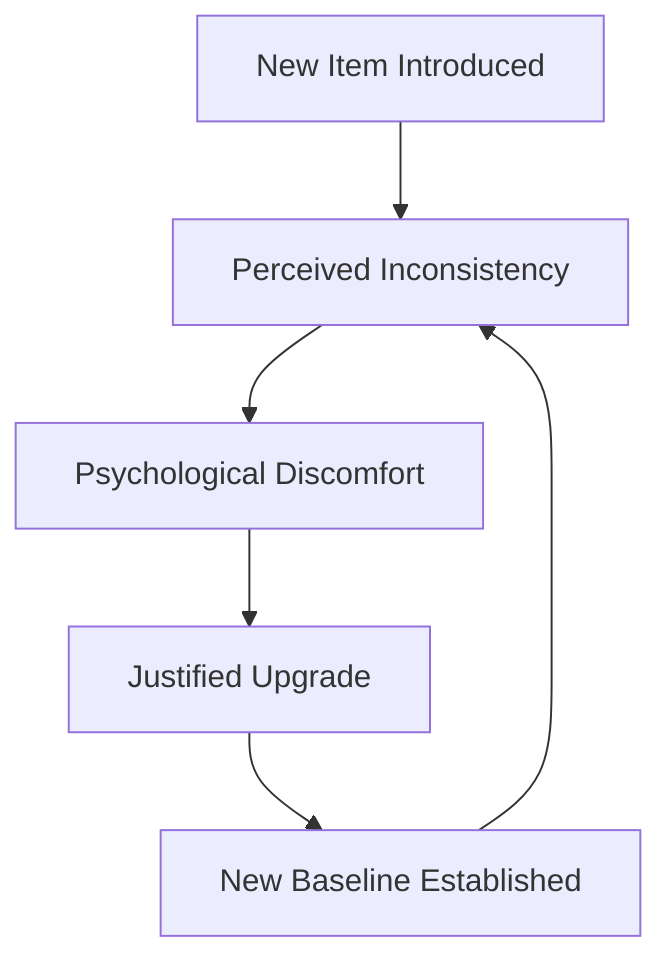
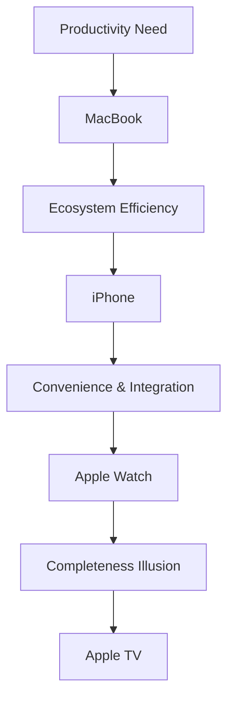
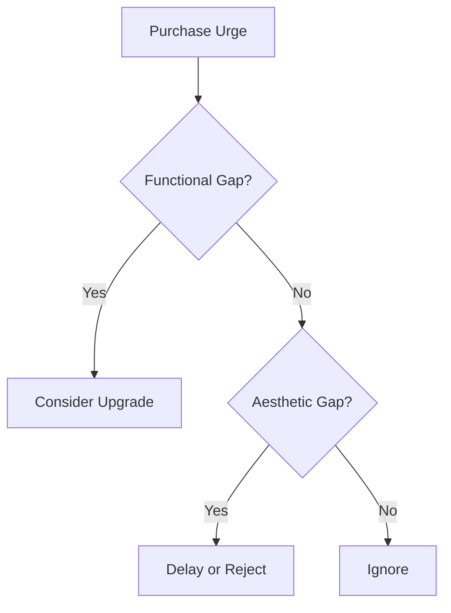
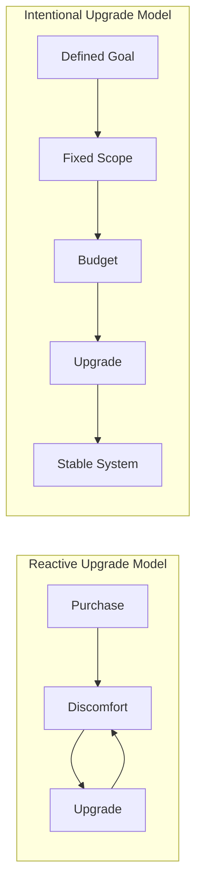
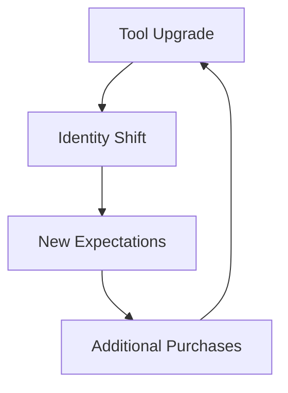
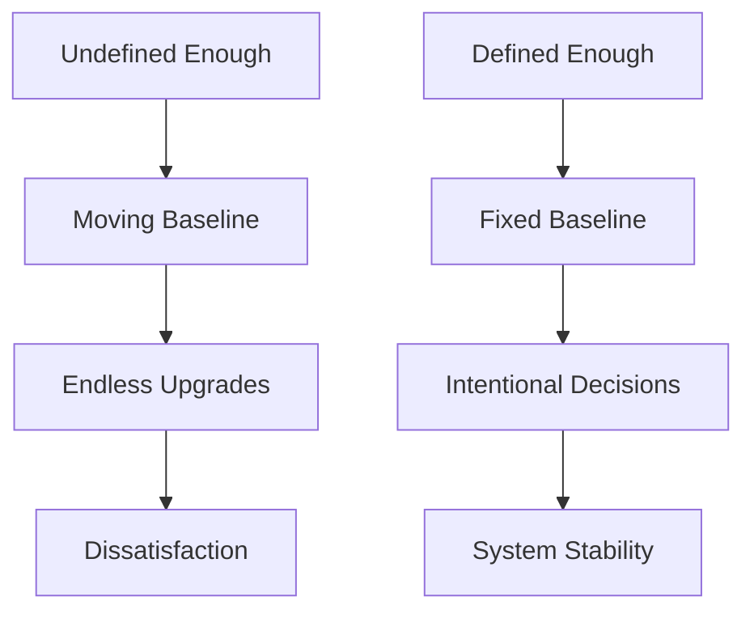

At the beginning of year (**2026**), I took some time to reflect on my past behavior, not in terms of code quality, architectural decisions, or career milestones, but something far more mundane and quietly expensive: **how I consume technology**.

One pattern stood out immediately.

I bought a **MacBook**, and at the time, it felt sufficient. It solved the problem I had: performance, portability, and a solid development environment. From a purely functional standpoint, nothing else was required.

But that sense of “enough” didn’t persist.

Shortly after, I justified getting an **iPhone** partly for convenience, partly for the ecosystem. Once that was in place, the **Apple Watch** began to feel like a logical extension: notifications, health tracking, tighter integration. And somehow, even after all that, an **Apple TV** entered the setup  as if the system was still incomplete.

Individually, each purchase was defensible. Collectively, they formed a pattern I hadn’t consciously designed.

What struck me during this reflection was not the spending itself, but the realization that **my definition of completeness kept shifting**. Satisfaction behaved like a moving target, always one accessory away.

Later, I came across a concept that explained this behavior with surprising precision: **The Diderot Effect**.

## What Is the Diderot Effect?

The **Diderot Effect** describes a behavioral phenomenon where **acquiring a new item triggers a cascade of related purchases**, driven by the need for consistency rather than necessity.

The concept originates from **Denis Diderot**, an 18th-century philosopher who, after receiving a luxurious new robe, felt compelled to replace much of his existing furniture because it no longer “matched” the new standard he had introduced.

In modern terms, the Diderot Effect is essentially **scope creep applied to consumption**.

## Why the Diderot Effect Resonates Strongly in Tech

Technology ecosystems are uniquely optimized to amplify this effect.

### 1. Ecosystem Lock-In as a Design Strategy

Modern tech products are rarely designed as standalone components. They are built as **interdependent systems**:

* Phone ↔ laptop ↔ watch ↔ TV
* Cloud services ↔ subscriptions ↔ hardware
* Accessories that unlock “full functionality”

Once you introduce a single high-tier component into your stack, the rest of your setup begins to feel like technical debt.

### 2. Identity-Driven Tooling

In tech, tools are not just utilities they are signals. Owning certain devices, editors, keyboards, or setups subtly communicates:

* Competence
* Professionalism
* “Seriousness” about the craft

The internal logic becomes:

> *If I’m this kind of developer, my tools should reflect that.*

This is where the Diderot Effect stops being about objects and starts being about **identity coherence**.

### 3. Optimization Culture

Engineers are trained to optimize systems. Unfortunately, that mindset often spills into consumption:

* Latency → upgrade
* Minor friction → replace
* Marginal improvement → justify cost

Not every inefficiency needs a hardware solution but the instinct is deeply ingrained.

## Real-World Tech Examples of the Diderot Effect

* Buying a new laptop → external monitor → mechanical keyboard → standing desk
* Upgrading a phone → earbuds → watch → chargers in every room
* Improving a dev setup → paid tools → subscriptions → cloud services

Each step feels incremental. The aggregate cost rarely does.

## The Hidden Costs Engineers Often Overlook

### 1. Financial Leakage Through “Reasonable” Decisions

Most Diderot-driven purchases pass basic rational checks. The problem isn’t irrationality it’s **unbounded justification**.

### 2. Perpetual Dissatisfaction

When standards continuously shift upward, stability disappears. You’re always upgrading the environment instead of leveraging it.

### 3. Loss of Intentional System Design

Your setup evolves reactively rather than architecturally.

## Managing the Diderot Effect as a Technical Thinker

The solution isn’t abstinence it’s **intentional system design**.

### 1. Introduce Decision Latency

Treat secondary purchases like production changes:

* Add a delay (48 hours, a week, or a sprint)
* Re-evaluate the actual requirement

Most impulses decay with time.

### 2. Define System Boundaries

Before upgrading, explicitly define the scope:

> “This purchase solves *this* problem. Nothing else changes.”

Boundaries prevent cascade failures.

### 3. Separate Functional Debt from Aesthetic Debt

Ask:

* Is this blocking productivity?
* Or does it simply look inferior relative to a new baseline?

Most Diderot chains are triggered by aesthetics masquerading as inefficiency.

### 4. Budget Upgrades as Projects, Not Reactions

Instead of ad-hoc improvements:

* Plan upgrades quarterly or annually
* Allocate fixed budgets
* Close the project when scope is met

No silent expansions.

### 5. Be Wary of Identity-Based Justifications

Phrases like:

* “At my level, I should have…”
* “This setup doesn’t reflect where I am now…”

These are signals that the Diderot Effect is driving the decision, not necessity.

## When the Diderot Effect Can Be Used Intentionally

Not all cascades are bad.

Applied deliberately, the effect can reinforce positive systems:

* Fitness → nutrition → sleep optimization
* Learning → better tools → deeper focus
* Workspace upgrades that genuinely reduce friction

The difference lies in **conscious orchestration** versus unconscious drift.

## Final Thoughts

The Diderot Effect is not a failure of discipline, it’s a **predictable system behavior** triggered by introducing a higher standard into an existing environment.

In tech, where optimization and cohesion are prized, this effect is especially potent.

Reflecting on my own experience, from a single MacBook purchase to a fully integrated ecosystem  made one thing clear:
**“Enough” must be explicitly defined, or it will keep moving.**

As engineers, we design systems for a living.
Our consumption habits deserve the same level of intentionality.

