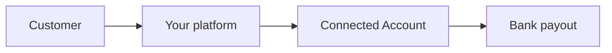

This is the **Accounts v2** companion to the **[original Connect guide (Accounts v1)](/posts/integrating-to-stripe/)**. Same **platform concepts**—Standard, Express, Custom, money flow, compliance—but the **API shape** is the one Stripe describes in **[Connect and the Accounts v2 API](https://docs.stripe.com/connect/accounts-v2)**. Use the older post when you must stay on **v1** (`Account.create` with `type=express`, OAuth-only Standard flows, etc.). Use **this** post when you are designing around **one `Account`**, **configurations**, and **`customer_account`**.

> **Heads-up:** v2 uses **different endpoints and JSON** than classic `Accounts` CRUD. Always confirm **API version**, **preview flags**, and **SDK support** in **[Stripe’s documentation](https://docs.stripe.com/connect/accounts-v2)** before shipping production code.
{: .prompt-tip }

## What is Stripe Connect?

Stripe Connect is for **platforms** that move money between **buyers**, **sellers**, and **your platform**. You connect **connected accounts** to your **platform account** so you can:

* Collect payments from customers  
* Pay out to sellers or service providers  
* Take **application fees** where appropriate  

Stripe holds the **payments** rail; you own **product and UX** choices.

## Two ideas at once: “style” (Standard / Express / Custom) and “shape” (v2 configurations)

The **[original guide](/posts/integrating-to-stripe/)** compares **Standard**, **Express**, and **Custom** as **who owns onboarding, dashboards, and compliance**.

**Accounts v2** adds a separate axis: **what capabilities** a single **`Account`** has, expressed as **configurations**:

| Configuration (v2) | Role in plain language |
| -------------------- | ---------------------- |
| **`merchant`** | Accept card payments, get paid out—what you usually wanted from a **connected account** selling on your platform. |
| **`customer`** | Be **billed like a customer** (subscriptions, invoices to your platform) using the **same** Account identity—often replacing a separate **Customer** object for that business. |
| **`recipient`** | Receive **transfers** (e.g. indirect charges), using the v2 **transfer** capabilities Stripe documents for recipients. |

You can assign **one or more** configurations to the **same** `Account`. That is the core promise of v2: **one identity**, **multiple roles**, **less manual ID mapping**.

The **Standard / Express / Custom** choice is still **real**: it describes **OAuth vs Stripe-hosted onboarding vs fully custom UI**. On v2 you implement those **experiences** while creating and updating **Accounts** through the **v2** surface (where supported).

## Standard vs Express vs Custom (unchanged product trade-offs)

| Feature / aspect | **Standard** | **Express** | **Custom** |
| ------------------ | ------------- | ------------ | ---------- |
| **Who owns the Stripe relationship** | The user’s **existing** Stripe user; you connect via **OAuth**. | You create **connected accounts**; Stripe hosts **onboarding** and a **light** dashboard. | You own **all** UX; Stripe is invisible to end users. |
| **KYC / onboarding** | User uses **Stripe Dashboard**. | **Stripe-hosted** onboarding (Account Links, etc., per current docs). | **You** collect data and satisfy Stripe requirements via API. |
| **Dashboard** | Full **Stripe** dashboard for the user. | **Express** dashboard. | **None** unless you build it. |
| **Best when** | Sellers **already** have Stripe. | You need **speed** and shared compliance. | You need **full** branding and control. |

On **v2**, you still make these **product** choices—but you attach **merchant** / **customer** / **recipient** **configurations** to match what each connected business must do.

## Architectural overview

Fund flow is unchanged at a high level:



**What changes in v2** is **object modeling**:

* One **`Account`** can represent **both** “seller” and “buyer of your SaaS” if you add **`merchant`** and **`customer`** configurations.  
* APIs that took **`customer`** may accept **`customer_account`** with an **Account** ID—see **[using Accounts as customers](https://docs.stripe.com/connect/use-accounts-as-customers)**.

## Accounts v2 primitives (before code)

Stripe’s v2 **`Account`** objects differ from v1’s flat `Account` create. You typically send:

* **`identity`** — country, entity type, business details.  
* **`configuration`** — nested blocks such as **`merchant`**, **`customer`**, **`recipient`**, each with **capabilities** you request (`card_payments`, balance / payout capabilities as named in current docs).  
* **`defaults`** — currency, locales, responsibilities (fees / losses collector), etc.  
* **`include`** — ask the API to return nested sections (e.g. `configuration.merchant`, `requirements`).

Responses may **omit** fields unless you **`include`** them—see Stripe’s note on **[includable response values](https://docs.stripe.com/api-includable-response-values)**.

**API version:** v2 calls often require a specific **`Stripe-Version`** header (including **preview** versions while the API evolves). Set this from the **exact** value in **[Stripe’s Accounts v2 docs](https://docs.stripe.com/connect/accounts-v2)** for your integration window.

## Implementation: creating an Account on v2 (HTTP-first)

Official examples are **REST + JSON**. Below is **illustrative**—copy **field names**, **capability keys**, and **version** from the current docs, not from this blog alone.

### cURL (canonical pattern from Stripe)

Stripe documents **`POST /v2/core/accounts`** with a JSON body. Conceptually:

```bash
curl -X POST https://api.stripe.com/v2/core/accounts \
  -H "Authorization: Bearer sk_test_..." \
  -H "Stripe-Version: <version-from-stripe-docs>" \
  -H "Content-Type: application/json" \
  --data '{
    "contact_email": "seller@example.com",
    "display_name": "Example Seller",
    "identity": {
      "country": "us",
      "entity_type": "company",
      "business_details": { "registered_name": "Example Co" }
    },
    "configuration": {
      "merchant": {
        "capabilities": {
          "card_payments": { "requested": true }
        }
      },
      "customer": {
        "capabilities": {
          "automatic_indirect_tax": { "requested": true }
        }
      }
    },
    "defaults": {
      "currency": "usd",
      "responsibilities": {
        "fees_collector": "stripe",
        "losses_collector": "stripe"
      },
      "locales": ["en-US"]
    },
    "include": [
      "configuration.customer",
      "configuration.merchant",
      "identity",
      "requirements"
    ]
  }'
```

This shows the **mental model**: **one** create, **multiple** configurations, **explicit** includes.

### Python (generic HTTP client)

Until your **`stripe`** SDK exposes stable helpers for every v2 path, **`httpx`** or **`requests`** keeps you aligned with the docs:

```python
import os
import requests

def create_account_v2():
    r = requests.post(
        "https://api.stripe.com/v2/core/accounts",
        headers={
            "Authorization": f"Bearer {os.environ['STRIPE_SECRET_KEY']}",
            "Stripe-Version": "<version-from-stripe-docs>",
            "Content-Type": "application/json",
        },
        json={
            # ...same structure as the cURL example...
        },
        timeout=30,
    )
    r.raise_for_status()
    return r.json()
```

### PHP (Laravel-style)

Use **Guzzle** or Laravel **`Http::withHeaders([...])->post(...)`** with the same URL, **`Stripe-Version`**, and JSON body. Keep **secrets** in **config**, not in source control.

### C# (.NET)

Use **`HttpClient`** with **`StringContent(json, Encoding.UTF8, "application/json")`** and the same headers. Deserialize the JSON response into your own DTOs that track **`id`**, **`requirements`**, and **`configuration.*`** state.

> **OAuth / Standard accounts:** Stripe currently directs platforms that authenticate with **OAuth** to connected accounts to **continue using v1** for that path. Treat **Standard** as **documented in the [v1 guide](/posts/integrating-to-stripe/)** until your OAuth + v2 story is explicitly supported for your use case—see **[Accounts v2](https://docs.stripe.com/connect/accounts-v2)** and **[OAuth](https://docs.stripe.com/stripe-apps/api-authentication/oauth)**.
{: .prompt-tip }

## Onboarding links (Express-style flows)

For **Express-like** experiences you still send users through **Stripe-hosted onboarding** where the product allows it. With a **connected account ID** returned from v2 (`acct_...`), **`Account Links`** (v1 resource) remain the usual tool for **`account_onboarding`**—the same pattern as the **[v1 article](/posts/integrating-to-stripe/)**, but the **`account`** value may come from a **v2** create. Verify compatibility for your **API version** in Stripe’s docs.

**Python (v1 Account Links API, account id from v2 create):**

```python
import stripe
stripe.api_key = os.environ["STRIPE_SECRET_KEY"]

link = stripe.AccountLink.create(
    account=connected_account_id,
    refresh_url="https://yourapp.com/reauth",
    return_url="https://yourapp.com/complete",
    type="account_onboarding",
)
```

## Custom-style integrations on v2

**Custom** still means: **you** own KYC collection, ToS acceptance, and ongoing verification. On v2 you express that by:

* Sending **complete `identity`** data the API requires.  
* Requesting **`merchant`** / **`recipient`** capabilities your product needs.  
* Handling **`requirements`** and **webhooks** the same way you would for Custom on v1—only the **payload shape** differs.

You may still use **`tos_acceptance`**-style fields where the v2 schema maps them; follow **Stripe’s v2 reference** for exact property names.

## Using Accounts as customers (`customer_account`)

Where you used **`customer=cus_...`**, many flows accept **`customer_account=acct_...`** for an Account that has the **`customer`** configuration. Example pattern from Stripe (conceptual):

```bash
curl https://api.stripe.com/v1/setup_intents \
  -u "sk_test_...:" \
  -H "Stripe-Version: <version-from-stripe-docs>" \
  -d customer_account=acct_123 \
  -d "payment_method_types[]=card" \
  -d confirm=true \
  -d usage=off_session
```

Details and supported objects live under **[using Accounts as customers](https://docs.stripe.com/connect/use-accounts-as-customers)**.

## Checking balances

For many **Connect** operations, **connected account** scoping is unchanged. **Python:**

```python
balance = stripe.Balance.retrieve(stripe_account=account_id)
```

**PHP:**

```php
$balance = \Stripe\Balance::retrieve([], ['stripe_account' => $accountId]);
```

**C#:**

```csharp
var balance = await stripe.Balance.GetAsync(
    new BalanceGetOptions(),
    new RequestOptions { StripeAccount = accountId }
);
```

Confirm in Stripe’s docs whether your **v2** account IDs behave identically for every **Balance** and **v1** helper you rely on during migration.

## Compliance responsibilities

The **Standard / Express / Custom** compliance split from the **[original article](/posts/integrating-to-stripe/)** still applies **who** collects KYC and **who** owns disputes. **v2** can **reduce duplicate** identity collection when you **add** configurations to an **existing** Account instead of opening a second **Customer** record.

| Responsibility | Standard | Express | Custom |
| -------------- | -------- | ------- | ------ |
| KYC | Stripe | Mostly Stripe | You |
| Tax reporting | Stripe-heavy | Shared | Often you |
| PCI | Stripe-hosted elements | Shared | Mostly you |
| Disputes | Stripe-heavy | Shared | Often you |

## Choosing a path

| Scenario | Style to favor | v2 angle |
| -------- | -------------- | -------- |
| Sellers already on Stripe; OAuth | **Standard** | Often **v1 OAuth** until Stripe supports your OAuth + v2 plan |
| Fast marketplace onboarding | **Express** | **v2** `Account` + **`merchant`** + Account Links |
| White-label, embedded finance | **Custom** | **v2** full **`identity`** + capabilities + your UI |
| Same business pays you *and* sells on your platform | **Express** or **Custom** | Same **`Account`**, **`merchant`** + **`customer`** configurations |

## Strategic considerations

* **Time-to-market:** Standard (when OAuth fits) < Express < Custom.  
* **API surface:** v2 adds **configuration** discipline—plan for **migration** from v1, not an eternal split (Stripe **discourages** maintaining both versions indefinitely without a plan).  
* **SDKs:** Expect to use **HTTP** for some **v2** paths until your language SDK is fully aligned.

## Final thoughts

**Accounts v2** does not erase **Standard / Express / Custom**—it **repackages** how you **represent** connected users in the API. Start from **[Connect and the Accounts v2 API](https://docs.stripe.com/connect/accounts-v2)**, add **[using Accounts as customers](https://docs.stripe.com/connect/use-accounts-as-customers)** when the same legal entity both **sells** and **buys** from your platform, and keep the **[v1 Connect guide](/posts/integrating-to-stripe/)** handy for **OAuth** flows and **legacy** snippets until you have fully moved.

Either way, you still trade off **control**, **compliance**, and **complexity**—only the **object model** got a long-overdue upgrade.
